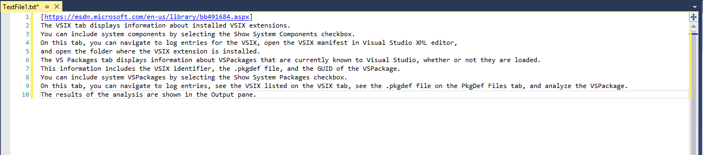

# SmartNextOcurrence

I decided to create this, to turn development easier and optimized like tools wich exists on another tools, like a [vscode](https://code.visualstudio.com/).

This extension allow to put an caret/cursor on next ocurrence of an selected word in Visual Studio.

With **Ctrl+D** hotkeys you can create a new cursor on next ocurrence of the same selected word.

Look those imagens to see how it works ;D  
  
  
  
  
  
This extension needs some improvements, feel free to contribute and help to take it better.  

## Changelog
- 1.0
    - Project start
    - Ctrl+D feature
    - Selection feature

- 1.1    
    - Selection improvement.
    - Added copy selection.
- 1.2
    - Improve text selection.
  
OBS.:: To run extension to debug, you need to configure the project  
On **Project Properties** at **Debug** tab, check the option **Start external program** and set to your *devenv.exe* like that:
```
C:\Program Files (x86)\Microsoft Visual Studio 14.0\Common7\IDE\devenv.exe
```  
And at field **Command line arguments** you need to put that:
```
/rootsuffix Exp
``` 
Done! Now you can run the extension to debug.  
  
  
[](https://www.paypal.com/cgi-bin/webscr?cmd=_donations&business=BRXEJLMRQHRAG&lc=US&item_name=Smart&item_number=SmartNextOcurrence&currency_code=USD&bn=PP%2dDonationsBF%3abtn_donateCC_LG%2egif%3aNonHosted)
    
Danke  
  