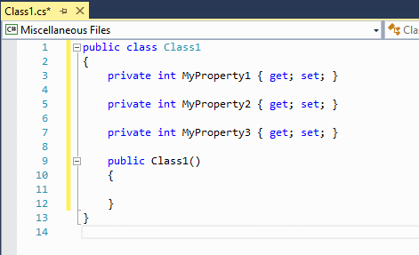

# SmartNextOcurrence

I decided to create this, to turn development easier and optimized like tools wich exists on another tools, like a vscode.

This extension allow to put an caret/cursor on next ocurrence of an selected word in Visual Studio.

With **Ctrl+D** hotkeys you can create a new cursor on next ocurrence of the same selected word.

Look those imagens to see how it works ;D  
  
  
  
  
  
This extension needs some improvements, feel free to contribute and help to take it better.  
  
Danke  
